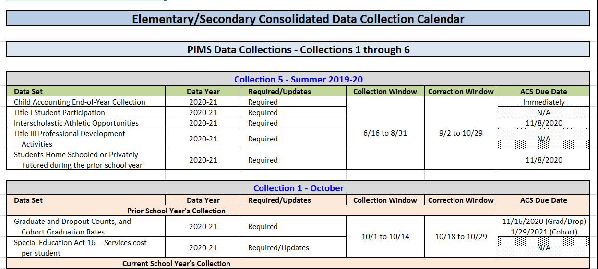

# What is PIMS?

The Pennsylvania Information Management System (PIMS) is a free Statewide Longitudinal Data System (SLDS). PIMS allows the Pennsylvania Department of Education (PDE) to collect, store, and analyze individual data for publicly educated, pre-K through 12th grade students across the commonwealth to help districts, schools, and teachers make informed, data-driven decisions that improve student learning.

## How does the PIMS Process Work?

-   **Submission:** Each local education agency (LEA) is required to submit updated data to PDE throughout the year based on a Data Collection Calendar. This information is submitted through a set of templates specific to each data type that are uploaded to the PIMS website.
-   **Review:** Information received through the PIMS Application is stored in a data warehouse that is refreshed twice daily to capture the most current data. LEAs can review the data that has been submitted to PDE by running various collection-specific error and verification reports using the PIMSReportsV2 Application. These reports can be distributed to the appropriate subject experts throughout the LEA and reviewed for accuracy. The review process allows LEAs to make necessary corrections to ensure data quality.
-   **Verification**: Each LEA is required to designate one Chief School Administrator (CSA) that has the authority to sign official documentation as a representative of the LEA. When the data submitted to PDE has been verified for a collection, an Accuracy Certification Statement (ACS) is generated from PIMS Reports V2. The ACS provides a summary of the data that is stored in PIMS and is signed by the CSA as an indication that the LEA agrees that the ACS accurately reflects the information that was submitted.

# Identifying your Data Quality Team

Maintaining quality data requires a team effort. It is important for PIMS Administrators to identify their data team to follow review timelines and keep data submissions on track. Every LEA should identify and maintain a current list with contact information for the following individuals (this list is not all-inclusive and should be adapted based on the needs of your LEA):

-   **Data Entry Personnel:** Individuals that input raw data into your Student Information, Scheduling and Personnel systems (i.e., Secretaries, Registrar, HR);
-   **Data Reviewer(s):** Individuals that are knowledgeable about the data being submitted to PDE for the current collection. The individual(s) that would be considered the subject matter expert (i.e., Principals, Special Education Director, Curriculum Director). You should be able to identify and contact a data reviewer(s) for each PIMS Collection type.
-   **PIMS Administrator(s):** Extracts, prepares and uploads PIMS files. Runs PIMS reports and reviews errors. Communicates errors and data issues to the appropriate LEA staff.
-   **IT Staff:** Submission and review of PIMS data will require technical functions not limited to upload, transfer, and manipulation of data files. Your LEA IT staff will be your primary resource for maintaining both internet access and internal system functionality, as well as providing any training required to effectively work with data file types.
-   **Vendor Contact(s):** PIMS Administrators or a designated individual within the LEA should have contact information for each Internal Data Management system (SIS, Personnel, etc.) for technical issues related to data entry or file generation. These systems are unique to each LEA and troubleshooting cannot be performed by PDE or PIMS Application Support staff.
-   **IU Point of Contact (IU POC):** Each LEA is assigned to an Intermediate Unit and has a contact that can assist with PIMS related data questions and guidance. The IU POC also provides updated information for important resources such as monthly Data Quality Network (DQN) meetings and can set up Data Quality Curriculum (DQC) training.
-   **Chief School Administrator (CSA):** The individual within your LEA that can sign ACS statements and validate PIMS data submissions. Their job title is typically a Superintendent or Chief Administrative Officer, but if the position is vacant, the LEA must designate an individual with signing authority.

:::tip
It is crucial to maintain an up-to-date list of contact information for all members of your Data Quality Team to ensure smooth communication and timely resolution of data-related issues.
:::

---
# PIMS Data Collection Calendar Overview

PIMS submissions are statewide data that are collected throughout the year in condensed, subject area Collections. These collection timelines are outlined and described in the Elementary/Secondary Data Collection Calendar, which can be found on the [PDE PIMS Website](https://www.education.pa.gov/DataAndReporting/PIMS/ManualsCalendar/Pages/default.aspx). The Data Collection Calendar is a complex tool that offers pertinent PIMS information in multiple tabs and formats to suit various needs:

---
## PIMS Calendar

The PIMS Calendar tab offers an overview of PIMS data submissions minus Internal Snapshots for an LEA. Submissions are organized by Collection (A) and date of submission. Each Collection category lists the required Templates (B) to be submitted in PIMS for the specified collection, as well as the data submission window open and close dates (C). Data must be submitted without error by 12:00 pm (noon) to be included in an LEAs submission data for the collection. Once a window closes, extra steps must be taken to request access to upload any additional data or changes. The Calendar also provides the deadline for submission of the signed LEA ACS document (D) to validate the data submitted.

**Collection Descriptions:**

1.  Required Templates:

    

2.  Submission Window Open/Close Dates:

    

3.  ACS Due date:

    

## Internal Snapshots

In addition to the standard collections listed on the calendar there are separate Internal Snapshots collected by PDE. The internal snapshots are organized on a separate table and tab from the collection calendar. An internal snapshot captures point in time information based on student enrollment as of the snapshot date. LEAs maintain their student and enrollment data in between submission windows using the Collection 6 (C6) update, and PDE will pull the most current information on the scheduled snapshot date. PIMS will be unavailable for 24 hours while the snapshot data is being processed. There are a few differences in the information provided on the Internal Snapshot calendar, and they include: a column that tells which template data (A) is captured in the internal snapshot and the templates that must be updated prior to the deadline stated in the Comment column. The deadlines (B) for updating information in C6 are specified in the Comments and the Snapshot Run Date columns. This data is collected based on the date listed in the ”PIMS Internal Snapshot Date as of” column. There are times that the “Snapshot as of” and “Snapshot run dates” do not match. When running verification reports and ACS documents, you should use the “as of” date as the actual Snapshot Date.

1.  Internal Snapshot Templates:

1.  Deadlines:

## Change Log

The Change Log tab outlines any adjustments that were made to the submission calendar by PDE. It specifically indicates which tabs and collections were updated, what the basics of the change were, and the date the change was made. The changes are organized by Collection with the most recent changes highlighted in yellow.

## Executive Summary

The Executive Summary tab offers an overview of PIMS data submissions for an LEA but in a simplified format that still provides complete Collection and ACS deadline information. This format does remove the added details of template requirements that may not be as useful for non-PIMS Administrators.

## ACS Summary

The ACS Summary tab provides complete information for each PIMS Collection that requires submission of an ACS. The ACS Calendar is organized by Collection and data set (A). The ACS Calendar also provides the file path in PIMS Reports V2 (B) to generate and print the ACS document and the proper file name format (C) that should be used when submitting the ACS to PDE. The ACS due date (D) is the date that the verified and signed ACS document should be received by the appropriate PDE Program Office.

### Collection Descriptions

#### 1.  PIMS Reports V2 Path:

#### 1.  ACS File Naming:
    

#### 1.  ACS Due Date:
    

## PIMS Sandbox Refresh Schedule:

The PIMS Sandbox Refresh Schedule tab outlines when data is updated in each of the PIMS environments. PIMS data submissions are collected in an environment called Production. Data that is uploaded to PIMS is “refreshed” twice a day and once the refresh occurs, the data becomes available for updated PIMS reports. PIMS Sandbox is a test environment only. Files that are uploaded to Sandbox are not officially submitted to PDE and do not become part of the data warehouse. Data collections are often available in Sandbox before the official submission window opens in Production. Sandbox allows LEAs to upload data and check their files for errors prior to officially submitting the data to PIMS. Because Sandbox does not warehouse the official PIMS submission data, it may not always reflect the latest correction and updates that an LEA makes. Sandbox is refreshed on the dates provided by the PIMS Sandbox Refresh Schedule. When refreshed, the most current data is exported from PIMS Production and imported into the Sandbox environment.

## PIMS Dates (only):

The PIMS Dates (only) tab is similar to the PIMS Calendar tab, however, the PIMS Dates (only) tab has the Internal Snapshots incorporated into the C6 collection and all dates are listed chronologically (not by collection). This tab offers a complete list of all PIMS-related data submission deadlines.

# PIMS Manual Overview

The PIMS Manual is a comprehensive guide to PIMS data reporting. The manuals, Volume 1 and 2, are the primary source of information for all data submission templates and data values. The manuals are available on the [PDE PIMS Website](https://www.education.pa.gov/DataAndReporting/PIMS/ManualsCalendar/Pages/default.aspx).

## PIMS Manual Volume 1

Each year, the PDE Data Quality team and PDE Program Offices make changes and updates to the manuals based on new legislation or prior year data issues. There are rare occasions throughout the year when out-of-cycle changes need to be made for similar reasons or for clarifications that help ensure data quality. These out-of-cycle changes will be updated in the manual(s), and communication will be sent to all the LEAs. All changes are tracked in each volume of the PIMS Manual in their own change summary table. These changes are also indicated throughout the manual with yellow highlights.

[PIMS User Manual Vol 1 - Change Summary](media/af5fb8ff13112ccd6bc3e8d75a22766d.jpeg)

The manual contains a section that provides a general overview of working with PIMS templates. A template is the file layout that is used to upload information to PIMS. Each template is unique to the type of data being collected. Some templates in a collection have load sequence dependencies, which means another template must first be successfully submitted in PIMS prior to the next file being accepted. These dependencies are simply based on the logic that is required to validate data. For example, the Course Template is required prior to submitting the Course Instructor or Student Course Enrollment Templates (if there is no record that a course exists, then that course cannot have course sections or enrolled students).

Template dependencies are found in the PIMS Template Dependency table:

[PIMS User Manual Vol 1 - PIMS Template Dependency](media/96a836edab3e4c779585b440629e2e2b.PNG)

Each collection has a domain that provides detailed report specifications for its individual templates:

[PIMS User Manual Vol 1 - Table of Contents](media/cb4ccc32009a5b4dbc381328957f239a.PNG)

Each field of the template is clearly explained in the file specifications (specs) provided in the manual. An example of a file spec is shown below:

[PIMS User Manual Vol 1 - Data Template & Data Fields](media/a1577a82a80bae22e443bb357dc87607.png)

What the column headers and cell contents mean:

-   Field No. – Each field of a template is associated with a column of data in the submission file (Field 1= Column A, Field 2= Column B, etc.). Each line (field no.) in the report spec is telling you what the corresponding column of your data file should look like and what information it should contain.
-   Max Length – Each field (column) has a maximum length or maximum number of characters permitted in a data value.
-   Name – Each field has a name that is recognized by PIMS. If you generated template files that contain headers, the field name must match what is listed in the Manual. Some fields are listed as Not Collected. While no data is required in these fields, they must still be accounted for in the data template to maintain the required PIMS formatting.
-   R/O/CR – Defines if information in a field is Required, Optional, or Conditionally Required based on defined criteria. Required fields that are left blank will result in an error.
-   Code – Indicates if a field is considered U (Updateable) or K (Key). Data in key fields cannot be corrected without requesting a deletion of the incorrect data record, while data in updateable fields can be overwritten.
-   Definition – Brief explanation of what data goes in this field. Explains Conditional Requirements that must be met for CR defined fields.
-   Business Rules – PDE specified rules that must be met for specific data when indicated.
-   eScholar Name – Field name used for PIMS data. This is the field name often referred to in PIMS error messages. Does not always match template field name.
-   Sample/Valid Value – Provides an example of an acceptable value, a selection of valid values, or a location to find valid values that are appropriate for the data being collected.

## Excel Reporting Tools

There are some data templates listed under the District and Location domains that are classified as Excel Tools. This means that an Excel file has been provided by PDE through a link on the [PDE PIMS website](https://www.education.pa.gov/DataAndReporting/PIMS/ReportingTools/Pages/default.aspx) or via e-mail directly from the Data Quality Office. These files are downloadable and contain instructions for completion, allowing LEAs to input their data to generate a District Fact Template file or a Location Fact Template file for upload to PIMS.

## **PIMS Manual Volume 2**

PIMS Manual Volume 2 is a collection of appendices that provide valid values for PIMS data collection templates. Data fields that require values taken from PIMS Manual Volume 2 are specified in the template report specs Sample/Valid Value column. Similar to Volume 1, Volume 2 also contains a Change Summary that is updated annually or as needed. All changes are logged in the summary table and highlighted in yellow.

Several appendices are too large to view and work on in the pages of Volume 2 of the manual. These appendices were removed from Volume 2 and can be found in a separate Excel spreadsheet created and available on the Manuals and Calendar page of the PDE PIMS website. These appendices are listed in addition to PIMS Manual Volume 1 and 2, as seen below.

[PDE - PIMS Website - PIMS Manuals & Appendices](media/4df8a21a2b165187c990852a3c3f8096.jpeg)

# 

# MyPDESuite Overview

To access any PDE application, including PIMS, you must have access to MyPDESuite. Every LEA has a Security Administrator who must approve requests to grant you access to the necessary application, to submit PIMS data and review reports. Complete user information for registering and a login link for MyPDESuite is available on the [PDE PIMS website logon page](https://www.education.pa.gov/Pages/MyPDESuite.aspx). There are many helpful resources under “MyPDESuite Help Guides” including identifying your LEA’s Local Security Administrator, how to change your email and/or password, and registration details.

Registration for PIMS applications also identifies you as an LEA PIMS Administrator and adds you to the contact list used by PDE staff to send important email communications related to PIMS data. It is important that you have correct and current email information provided for each member of the PIMS submission team.

Once you have access to MyPDESuite, you can login and access PIMS, PIMS Sandbox, and PIMSReportsV2. Your MyPDESuite Application homepage will look different based on your access. There are links at the bottom of the page that allow you to request additional applications for approval by your Security Administrator.

[MyPDESuite - My Applications](media/be1fdac47c34da9769e570867bc2c6c4.png)

*Figure 1 - MyPDESuite Application Home Page*

**PIMS Submission Overview**

For files to be successfully submitted to the Pennsylvania Information Management System (PIMS) warehouse, the files must be uploaded through all the stages of production in the PIMS application.

1.  Templates are Uploaded into PIMS
2.  File Manager checks files for proper format and individual records for Errors
    1.  Files are then Added to a Batch
3.  Batch Manager reviews the files in the Batch and the PIMS Warehouse for errors via two types of validations:
    1.  Data Quality Engine (DQE)
    2.  Extract, Transform, and Load (ETL) Errors

The PIMS Sandbox application (See Figure 2) is a testing environment for review and preparation of files for PIMS submission. The files go through most of the same data validations as PIMS production but are not connected to the live PIMS warehouse and are not stored. After files have been successfully uploaded into the PIMS Sandbox, the files must also be uploaded into PIMS.

*This guide will focus on PIMS; however, the same processes and steps can be used in PIMS Sandbox.*

### **The PIMS Home Screen**

On the PIMS home screen, you will find:

1.  System Messages (See Figure 3)
    1.  Announces upcoming Internal Snapshots, downtime, or schedule changes
2.  Open Collections (See Figure 3)
    1.  “Collection” – Names of the collections that are currently available to upload to
    2.  “Description” – Lists the templates included in each collection and snapshot dates, if applicable.
    3.  “View DQE Rules” – Pop-up window that list the DQE rules executed in both File Manager and Batch Manager

        

        *Figure 3 - PIMS Application Home Page (notice the header does not say PIMS_Sandbox)*

### **Uploading Files**

Figure 4 shows the upload screen.

*Figure 4 - Upload Screen*

### Steps for uploading files:

1.  Select Data Submission and then select Upload Files
2.  Choose the Data Collection from the dropdown list:

    

*Figure 5 - Select Data Collection from the dropdown menu*

1.  Browse or Choose File to select the files to be uploaded:
    1.  Up to 9 files within the same Data Collection can be uploaded at a time

        *Figure 6 - Browse to choose the file to upload*

2.  Check the box for “File/All files within Zip file contain headers”, if the file has a Header Row:
    1.  If a file does not have a header, this box should not be checked. If the box is checked when a header is not present, the first data record in the file will be skipped because it is assumed to be a header row, resulting in fewer records than expected.
    2.  If a file does have a header and this box is not checked, the file will err in File Manager.

        

        *Figure 7 - Check box to indicate header row*

3.  Click the “Upload” Button:

    

*Figure 8 - Upload Button below Files*

### **Errors Uploading Files**

Errors may occur when uploading files if there is an issue with the naming convention or you are uploading a file that is not included in the collection that was selected.

When there is an upload error, hover the mouse over the \*Error – roll over with mouse to view message and a yellow box with the error message will appear (See Figure 9).

*Figure 9 - Error Message when uploading files*

Common file Upload Error Messages:

-   The template with \<table_name\> … is not available in the selected collection
    -   Verify the appropriate collection is selected from the Data Collection dropdown
        -   Descriptions for each Open Collection on the PIMS & Sandbox applications homepage list the templates included in each collection
    -   Verify the File Name is correct using the Target Table label identified in the appropriate template’s specification in PIMS Manual Volume 1
        -   Watch for invalid symbols, such as spaces or extra underscores
-   You cannot upload a 0KB file.
    -   Blank files (0 kilobytes) cannot be uploaded into PIMS
-   Invalid Timestamp
    -   There is something wrong with the timestamp format in the File Name
    -   Timestamps in the File Name should be in the format:  
        YYYYMMDDHHMM representing year, month, day, hour, and minute
        -   For example, 7/8/2019 at 10:53 am would be: 201907081053
    -   The Timestamp gives each file a unique name
-   File Already Exists in System means there is already a file in File Manager with the same name.
    -   Rename the file you are uploading (i.e., the timestamp), OR
    -   Delete the file in File Manager before uploading

### **File Manager and Validation Errors**

File Manager shows files that have been received by the application. Review the “Status” of each file and ensure they have passed validation. If a file did not pass validation, review the errors, and then make the appropriate corrections at the source and reupload the file.

Files with a Green Check status passed validations.

Files with a Red X in the Status column have errors (See Figure 10).

Validation Errors can be identified in one of two ways:

1.  Error List: This view displays the errors in a detail list.
2.  Highlighted Errors (Classic View): This view displays highlighted errors.

[File Manager Screen ](media/fb5bb416c125155ef7efea2d6b861dde.png)

*Figure 10 - File Manager Screen*

### **Reviewing Errors in File Manager**

In File Manager, review the errors for any files with a Red X in the Status column:

1.  Click the View Errors Button next to the Red X in the Actions column for the file (See Figure 10).
2.  Click the View Errors Button next to one of the Error Files on the Validation Information tab (See Figure 11).
    1.  Clicking on the View Source File button will allow you to download the Source file. The Source file shows what is being uploaded, it will NOT show any errors.

[Validation Information Screen - File Contents ](media/54f9762ce28bfa688df42753be3f1abc.png)

*Figure 11 - Validation Information screen*

1.  Selecting the “Error List” file will display the errors in an enumerated list.
    1.  Source Record Number in the uploaded file
    2.  Field Number and Field Name identify the field in error
        1.  Unless combination of fields causing the error, then see “Error Message Values” column
    3.  Field Value in the uploaded file
    4.  Key Fields used to uniquely identify the record
    5.  Error Message identifies the problem with the record
    6.  Error Message Values again identifies the fields and values in error.
        1.  When there is a combination of fields causing in error, all the fields appear in this column

*Figure 12 - Error List view of File Manager Errors*

1.  Selecting the “Highlighted Errors (Classic View)” file will display the entire record and highlight the fields in red that have the errors.
    1.  Hover over the Red in the “Highlighted Errors” to see a pop-up error message (See Figure 13)
2.  Both the “Error List” and “Highlighted Errors (Classic View)” will show the same errors. The errors are displayed in different formats and should be used based on personal preference.

    

*Figure 13 - Highlighted Errors view of File Manager with pop-up error message*

### **Common Error Messages in File Manager**

-   Failed Unique Student ID
    -   Verify the Student ID is valid and active in the PAsecureID application
        -   Note: It can take 24-48 hours for newly created PAsecureIDs to be synchronized with PIMS
-   Failed ISO Date
    -   Format dates to ISO format when reporting to PIMS:   
        YYYY-MM-DD (Such as 2020-06-30),
    -   If you open a file in Excel, Excel may change the date formats if not properly imported.
-   Failed Required
    -   Use the Template Specifications in the PIMS Manual Volume 1 to identify the Required fields.
    -   Refer to the R/O/CR column to identify the Required/Optional/Conditionally Required fields.
-   Failed Valid Values
    -   Use the “Sample/Valid Value” column in the Template Specifications of the PIMS Manual Volume 1 and Appendices in the PIMS Manual Volume 2 to identify the valid values for a field,
-   Conditionally Required Fields
    -   Some fields are conditionally required based on situations being reported or other fields reported in a record,
    -   Use the “Business Rule” column in the Template Specifications of the PIMS Manual Volume 1 to review any conditions for reporting a field,
        -   *For example*: If a student is reported with a Y (has IEP) in Special Education (Field 38 – Student template), then the Challenge Type (Field 34) must also be reported.
-   Compound Data Quality Engine Validations in File Manager
    -   Some fields have values that can only be used (or cannot be used) in conjunction with other field values.
    -   Many of the compound rules verify the “not” conditions for all students
        -   *For example:* If a student is reported with GS (Gifted, receives gifted services through IEP) in Gifted (Field 80 – Student template), then the student should also have a Y (has IEP) in Special Education (Field 38).
        -   These fields are not “conditionally” required because not all students with a Y (has IEP) in Special Education (Field 38) are also gifted, students may have N (not applicable) in Gifted (Field 80).

### **Batch Manager**

After files have been successfully validated in File Manager, files need to be added to a Batch to begin the DQE (Data Quality Engine) and ETL (Extract, Transfer, and Load) processes in Batch Manager.

Adding Files to a Batch:

1.  Check the Boxes for the Files to be added to the Batch
    1.  Files must be part of the same Collection.
    2.  Multiple instances of the same template cannot be in the same batch, even if each file has different records.

*Figure 14 - Add to Batch: Selecting Successful File Manager Upload*

1.  Click on the Add to Batch button.
2.  Click on the View Batch button that will appear after all files have been selected and added to a batch.

[Uploading Files - View Batch](media/ecbf5d319448b2f52885d8abfef70632.jpeg)

*Figure 15 - View Files Added to Batch*

1.  The next screen allows you to verify the files that were selected.
    1.  Include a comment to help identify the batch (Suggestion: include name of Collection). This makes it easier if PDE staff need to review a batch to troubleshoot errors.

[Uploading Files - Processing Batches](media/3c003a76520e3692aa90ec3e939aa26d.png)

*Figure 16 - Process Batch Button*

1.  Click on the Process Batch button to begin the next step in the data validations.
2.  The system will generate an email when the batch has processed.
3.  “Remove from List.”

### **Data Quality Engine (DQE) Errors in Batch Manager**

Errors are Identified in the Batch Details under the “Data Quality Engine Results”.

Batches with DQE issues will have a status of “DQE Complete” with a Red X in the Data Status. The DQE provides in depth data checks, comparing data being uploaded between files in the batch and records in the PIMS warehouse. The DQE may also compare fields on the templates being uploaded to data elements in other systems, such as PAsecureID, TIMS, EdNA, and Act80.

[Batch Manager - Batch with DQE Errors ](media/ba5cfbad18e13a3adbbfb85e236d5ba7.png)

*Figure 17 - Identifying Batch Errors  
*

### **Reviewing DQE Errors in Batch Manager**

In Batch Manager, batches with DQE errors should be reviewed. These batches will have a Batch Status of “DQE Complete” and the Red X in the Data Status column.

1.  Click on the View Errors button for the Batch in the Actions column. (See Figure 17)
2.  In the DATA QUALITY ENGINE RESULTS section, identify any red Xs in the “Pass/Fail DQE” column.

*Figure 18 - View Errors*

1.  Click on View Errors (See Figure 18) button for the selected Data Quality Checks that have issues.

When a Batch has DQE issues, *all* files in the batch fail and are not submitted to the PIMS warehouse. All the records and files in the batch must be reuploaded after corrections are made.

Some Data Quality Checks have a Threshold Rate greater than 0% (See Figure 19 – *next page*). In these instances, the “Pass/Fail DQE” status will be a Green Check if the error rate is less than the threshold, but there will be an Error Count and a View Errors button. Those issues should be reviewed for validity and corrected as needed. If the data is accurate and the Error Rate is under the Threshold Rate, those records will be submitted if all DQE Checks pass.

*Figure 19 - Threshold Rates*

### **Data Exceptions**

Most Data Quality Checks require corrections to the data in the source file. Then, the files need to be reuploaded. However, if the data is accurate, select the Request a Data Exception button and provide an explanation why it is accurate. A staff member at PDE will then review the exception and either approve or deny it. If the data exception is approved, the files begin the final ETL process. For a Data Exception to be approved, a few criteria must be met:

-   The data error must not be correctable.
-   A complete explanation of the error must be provided. Please note that saying, “This information is correct.” does not explain the error. Why is the information correct?
-   You must address all DQE errors. If there are multiple errors, you must meet the criteria for all errors, or the Data Exception request will be denied.

Common Student Data Quality Engine Issues:

-   Validation UID Student First Name/Last Name/DOB/Gender
    -   The First Name, Last Name, Date of Birth, and Gender on the Student file are compared to the PAsecureID application.
    -   Correct the system that has incorrect data and resubmit.
-   School Enrollment - Reported a WD code, verify Graduation Status is valid
    -   The Withdraw Code reported on the School Enrollment template is compared to the Grad Status (Field 65) on the Student template.
    -   Refer to Appendix E and AL for valid combinations.
-   Student and Enrollment - Student must have a School Enrollment record
    -   Each student uploaded on the Student template must have at least an entry record on the School Enrollment template, unless one of the following applies:
        -   If the grade is an Adult Affidavit Program (AAP);
        -   If the Grad Status (Field 65) is an “S”, indicating a Summer Special Education graduate that was reported as a graduate in the prior school year but exited Special Education after July 1;
        -   If the Grad Status (Field 65) is a “J”, indicating an incorrectly reported student that cannot be deleted due to existence in internal snapshots;
        -   If the Special Education Referral (Field 167) is “Y” and student has an active Individualized Education Program (IEP). This situation indicates that the student is not being educated by the district of residence but has been referred elsewhere for special education services; or
        -   (Does not apply to LEA Type CTC: School enrollment records are still required.) If AUN of Enrollment (Field 217) is not equal to Submitting AUN (Field 1). This situation indicates that the LEA reporting employs the staff teaching a non-enrolled student.
-   School Enrollment – Proper Enrollment Sequence
    -   Incorrect sequence of entry and withdraw records on the School Enrollment template.
    -   Comparing the records on the file and records in the PIMS warehouse from previous submissions, there must be an enrollment (E) or a re-enrollment (R) record before a withdraw (WD) record.
-   Overlapping Enrollment/Exit Records
    -   The School Enrollment records being uploaded must flow sequentially with other records in the file and already uploaded into the warehouse.
    -   Similar to the above error, there must be an E or R before a WD, and there cannot be two of the same right after each other (overlapping).
    -   When reading the error:
        -   [PIMS] identifies enrollment records already in the warehouse from a previous upload
        -   [Template File] identifies enrollment records in the file being uploaded

### **ETL Errors in Batch Manager**

Batches with Extract, Transfer, and Load (ETL) errors will have a status of “Complete” with a Red X in the Data Status (See Figure 20). Errors are identified with an X or E in the ERROR or ALERT files within the templates that have errors.

*Figure 20 - Batch Status and Data Status*

### **Reviewing ETL Errors in Batch Manager**

To see the ETL errors:

1.  Click on the View Errors button for the Batch.
2.  Find the Red Xs under BATCH FILES.
    1.  The Data Quality Engine Results may all have a “Pass/Fail DQE” status of Green Check indicating DQE was successful, but the Red X for the files indicates an ETL Error.
3.  Click on View Errors button for the file with errors (See Figure 21).

*Figure 21 - Batch Files Data Status*

1.  Under ETL GENERATED FILES (See Figure 22), find the ERROR files and click the View File button.
    1.  If ERROR_SOURCEFILE_MSG has a record count of 0, it can be disregarded.
    2.  The “Load_...” files are NOT errors files.

*Figure 22 - ETL Information*

1.  In the “ERROR_...” files, errors are identified with an X in one of the columns to show where the error occurred.
    1.  In the “ALERT_...” files, the errors are identified with an E.
    2.  Warnings will be identified with a W.
        1.  Warnings are submitted to the warehouse as reported. The warnings alert you to an anomaly in the data but are not necessarily an error.

ETL Errors stop the individual records with errors. The other records that did not have errors are submitted to PIMS. See the File Statistics and Table Statistics for the record counts.

Common ETL Errors in Batch Manager:

-   ERROR_KL_STUDENT - STUDENT ID NOT IN STUDENT TABLE
    -   The PAsecureID for the record with the error has not been successfully uploaded into the PIMS Warehouse on the Student template.
        -   This student has NOT been uploaded on the Student template.
        -   This student had errors on the Student template, so the record was not successful.
-   ERROR_KL_STAFF - PRIMARY INSTRUCTOR ID NOT IN STAFF TABLE
    -   The PPID listed as the Primary Instructor on the Course Instructor template has not yet been uploaded on the Staff template
-   ERROR_VALID_VALUES or ALERT_VALID_VALUES - LOCATION CODE OF RESIDENCE NOT FOUND IN LOCATION TABLE
    -   This error occurs when the School of Residence (Field 165) is not a school within the District of Residence AUN (Field 117).
-   ERROR_DUPLICATES
    -   The error message will show records that have the same Key fields.
-   ERROR_KL_MEASURE_CATEGORY_SET - Category Set Code not in Category Set table
    -   This error message typically occurs on the Location Fact or District Fact templates with a value is one of the Categories does not match

## **PIMS Reports V2 Overview**

When a batch has been successfully processed with a Green Check in PIMS Batch Manager, that does not guarantee accurate data. After the files have been successfully submitted, use PIMSReportsV2 to verify the data that was submitted is complete and accurate.

For example, a file that should have contained 100 students may have only had 10. A file with 10 records can be successfully uploaded but is not accurately showing the data for your LEA if there should be 100 students. Or 1,000 students may have been uploaded with a Y in Economically Disadvantaged and 300 were uploaded with N, when it should have been 300 reported as Y and 1000 as N. Here, PIMS will successfully upload the data because both Y and N are valid values, but that does not mean the values are accurate for the students in your LEA.

PIMSReportsV2 is another PDE application that is accessed through myPDESuite. If you are unable to see or run specific validation reports, you should contact your LEA’s Security Administrator.

PIMS reports are run through a system known as SQL Server Reporting Services (SSRS).

### **Verify vs Production**

PIMS Reports are broken into two different types based on where the data pulls:

-   Verify – Reports that can be run immediately after a successful PIMS submission and give details about data that was just uploaded. Most of these are “template verification reports.”
-   Production – Reports that can be run after a PIMS refresh and provide details about data currently in the PIMS data warehouse.

Within each PIMSReportsV2 file path there are folders that represent each data collection and contain validation or error reports designed specifically for that data. These reports can be exported into an Excel format that allows the user to filter and manipulate the data for detailed review.

### **Which reports should I run?**

The best resource for determining which reports to run for any given data collection is the collection-specific How To Guide provided on the PDE PIMS website (https://www.education.pa.gov/DataAndReporting/PIMS/Resources/Pages/HowtoGuides.aspx). Each How To Guide contains detailed information regarding which reports to review, the file path to locate the report and what errors to look for in the output.

It is important to run all reports for the appropriate school year and/or snapshot date. Dates for each collection are provided on the PIMS Elementary/Secondary Data Collection Calendar. PIMS reports are available for multiple Snapshot dates because templates can be and are used for multiple collections. For your report to accurately reflect the data that you are reviewing, you must select the correct corresponding Snapshot date.

All reports should be run in the background. Deadlines for PIMS reporting are statewide and there are often high volumes of LEAs running the same reports. Running in the background minimizes the stress on the Application. This reduces the time required to process report requests while also decreasing the likelihood of a system failure.

## **What is an ACS?**

An Accuracy Certification Statement (ACS) is an LEA’s validation of the information that has been submitted to PIMS. All ACS documents are generated from PIMS Reports V2. A complete listing of ACS report file paths and due dates are included in the PIMS Elementary/Secondary Data Collection Calendar. An ACS provides a summary of the key data elements for each data collection. The ACS will reflect the information that is in the data warehouse.

An ACS is an LEA’s official statement that they agree that the data shown is what was uploaded to PIMS. When an ACS has been verified by all data reviewers it must be signed by the Chief School Administrator (CSA) and submitted to PDE. Each ACS document has instructions for file naming conventions and the email address where the document should be submitted. It is important to review the instructions for each ACS (See Figure 19), as failure to follow the guidelines indicated could result in receipt of the data being delayed or even the document being lost.

*Figure23 - ACS Instructions*

## **Deletes and Overrides**

When you find errors reviewing your reports, corrections may be required after the submission window has closed. Data records that have updateable fields can be corrected by uploading a new record with the correct information. Errors in key field data require a delete. To request a deletion, you must contact Application Support and request a delete form. You will be assigned a Help Desk Ticket (Incident ID) number and the form will be provided. You must complete the form, with appropriate signatures, and submit to the Data Quality Office. PDE staff will review the deletion request and will follow up, if necessary, with any questions. You will receive notification once the deletion has been completed and corrected data records can be uploaded. The deletion forms contain options to allow specific records to be deleted from specific template or for entire templates to be removed. If you are deleting individual records, PDE allows a maximum of 10. If more than 10 records contain errors, you must delete and resubmit the entire data template.

To upload corrected data to PIMS outside of the submission window stated on the PIMS Calendar, you must contact Application Support and request an Override of Submission Closure. You will be provided with a Support Ticket number and the appropriate Override request form. Do not submit the request form until your corrected data is ready for upload. Overrides are granted for a limited amount of time, typically a couple of days, and failure to complete your upload by then will require you to restart the override process.

It is possible to create new errors during the delete or override process in the following ways:

-   Uploading before a requested deletion is completed
    -   Requesting a delete and failing to upload corrected data
    -   Requesting an override and uploading data that contains changes to Key fields which result in duplicate records or DQE errors

If you submit a delete or override request and change your data in any way, you must run and submit a new ACS document. Any time you change your data in any way, a new signed ACS document is required.

# PIMS Resources

The PIMS data process can seem like a daunting task but there are numerous resources available to assist in the process and to educate the data team:

[PDE Data Quality Staff](mailto:%20RA-DDQDataCollection@pa.gov):

-   PIMS Q&A – weekly live online forum hosted by the Data Quality Staff to answer individual questions related to PIMS data. Invitations are sent weekly to PIMS Administrators that have an email account registered through myPDESuite.
-   [PDE Data Summit](https://www.education.pa.gov/DataAndReporting/PDEDataSummit/Pages/default.aspx) - Annual conference with in-depth discussion of data-specific topics that cover all aspects of Statewide reporting. Each yearly conference has a different focus to ensure that participants are receiving the most current and relevant information.

[Application Support](https://www.education.pa.gov/DataAndReporting/PIMS/ApplicationSupport/Pages/default.aspx): 1-800-661-2423

[Data Quality Network](http://dataqualitynetwork.net):

-   Monthly DQN meeting hosted by your local Intermediate Unit (contact your IU DQN representative for information) http://dataqualitynetwork.net/

[PDE PIMS Website](https://www.education.pa.gov/DataAndReporting/PIMS/Pages/default.aspx)

-   PIMS Manual
-   PIMS Data Collection Calendar
-   PIMS Resources and Trainings including Collection specific How-To-Guides
