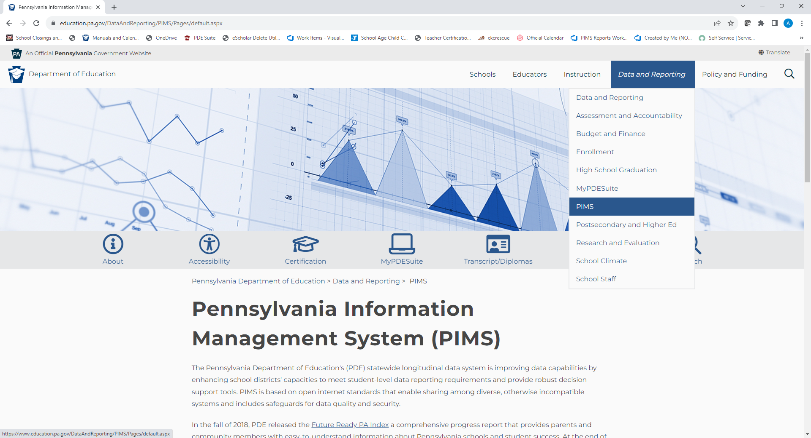
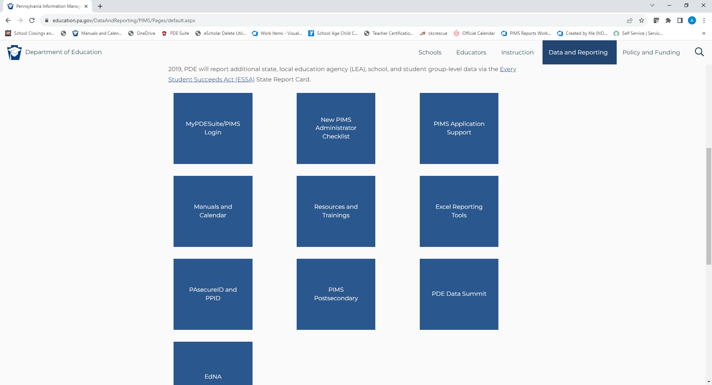
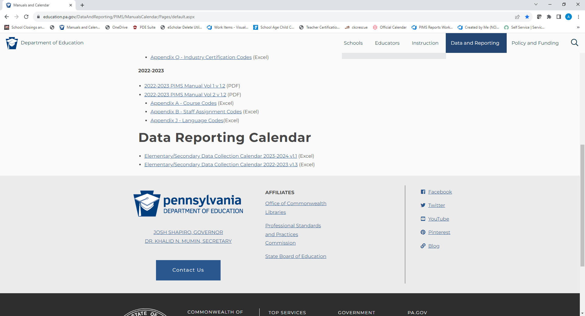

import Tabs from '@theme/Tabs';
import TabItem from '@theme/TabItem';

## Executive Summary

The October Student Data Set is the collection of student demographics that includes the reporting of low-income students, immigrant students, students who receive special education services, and English Learners. These data, which are mandated by the federal government, are collected for students who are educated by the local education agency (LEA) on the first business day in October of the current school year.

These data are used for several purposes, including Graduation, Dropout, and Cohort data sets, the Teacher Loan Forgiveness (TCLI) program, the Community Eligible Provision (CEP), Food Program Participation, and other public facing reporting. Data collected for the October Student Data Set are considered the official school enrollment count for the school year. They are reported to the federal government and are published on the Pennsylvania Department of Education (PDE) website.

Accurate and complete data are crucial because of the significance these data have on other data sets, programs, and funding. Therefore, it is critical for all LEA personnel responsible for PIMS-related data to collaborate to review, edit, and submit the data prior to the closing of the data set collection window. It is equally critical for the chief school administrator (CSA) to review and confirm the data are accurate prior to signing and submitting the Accuracy Certification Statement (ACS) to PDE.

:::note
The sources of data for the purposes of publishing the building level score, related to educator evaluation as required by Article XI of the School Code, are listed in the PIMS Manual, Volume 1, under the heading "Act 82 Data Reporting for Teacher and Principal Evaluation".
:::

## Collection Overview

The October Student Data Set is for the reporting of student data, including data on low-income students, immigrant students, special education students, and English Learners. The data collected are mandated by the federal government and are collected through the submission of data to the Pennsylvania Information Management System (PIMS). The PIMS administrator reports these data elements for the local education agency (LEA) through submission of the Student, Student Snapshot, School Enrollment, and Programs Fact templates to PIMS.

This data set is for reporting students who are educated by the LEA, as well as students who are referred to a non-PIMS-reporting entity, on the first business day in October of the current school year. This does not include students who were enrolled and withdrawn prior to this October date; or students who enroll at the LEA after the given October date of the current school year, or Special Education students who are referred to another PIMS-reporting institution outside of the LEA.

The LEA types listed below are required to submit data for the students who are educated by the LEA on the first business day in October:

1. School Districts (SD);
2. State Juvenile Correctional Institutions (SJCI);
3. Intermediate Units (IU);
4. Approved Private Schools (APS);
5. Charter Schools (CS), including cyber charter schools;
6. Private Residential Rehabilitation Institutions (PRRI); and
7. Career and Technical Centers (CTC).

The data submission is a two-step process:

1. Collection window; and
2. LEA Profile and ACS

## October Student Data Set

The October Student Data Set consists of the Student, Student Snapshot, School Enrollment, and Programs Fact templates. The Student Snapshot, School Enrollment, and Programs Fact templates are dependent on the Student template. If the Student Snapshot, School Enrollment, or Programs Fact template is submitted prior to the submission of the Student template, a Data Quality Engine (DQE) error is generated preventing the data from entering PIMS.

The following data are collected in the October Student Data Set and are included in data reporting for education evaluation:

1. October Enrollment Snapshot;
2. Promotion Rate – All Students;
3. Percentage of Gifted Students;
4. Gender;
5. Race/Ethnicity;
6. Low Income; and
7. English Learner (EL).

### Student Template

The Student template is the foundation for student reporting; it must be submitted to PIMS prior to submitting any other template that requires student data. In addition to the October Student Snapshot, the internal snapshots (taken throughout the school year by PDE) rely on the Student template's accuracy. Therefore, updates to the Student template should be submitted throughout the school year to ensure the internal snapshots are capturing accurate and complete data. The Graduate, Dropout, and Cohort Data Set is also pulled from the Student template. Additionally, all internal snapshots pull demographic data from the Student template.

### Student Snapshot Template

Although the Student and Student Snapshot template collect the same data, they perform different functions. The Student Snapshot template captures the data on a specific date, whereas the Student template changes throughout the school year. The Student Snapshot template not only captures the data for the October Snapshot date, but also serves as the base for other internal snapshot reporting purposes.

### School Enrollment Template

The purpose of the School Enrollment template is to track the mobility of a student as the student transfers from one school to another or the student withdraws from school. The student's mobility is tracked by entering the enrollment date and the withdrawal date every time the student moves from one school to another, changes grade, or has a program change within an LEA, or if the student drops out of school. A student who enrolls in an LEA, reenrolls within the same LEA due to grade or program change, or withdraws several times in a school year will have multiple records in the template. Students who attend a CTC that does not provide primary academics will have school enrollment records for both the school district and the CTC. The School Enrollment template is also used in collaboration with the Student template for attribution in Graduation cohort data. All internal snapshots are pulled using the school enrollment template in conjunction with the demographics from the student template on the date specified.

The School Enrollment template is a required submission for all LEA types when the Student template is submitted, unless one of the following applies:

1. If the grade is an Adult Affidavit Program (AAP);
2. If the Grad Status (field 65) is an "S", indicating a Summer Special Education graduate that was reported as a graduate in the prior school year but exited Special Education after July 1;
3. If the Grad Status (field 65) is a "J", indicating an incorrectly reported student that cannot be deleted due to existence in internal snapshots;
4. If the Special Education Referral (Field 167) is "Y" and student has an active Individualized Education Program (IEP). This situation indicates that the student is not being educated by the district of residence but has been referred elsewhere for special education services; or
5. If AUN of Enrollment (Field 217) is not equal to Submitting AUN (Field 1). This situation indicates that the LEA reporting employs the staff teaching a non-enrolled student. (Does not apply to LEA Type CTC: School enrollment records are still required.)

See list of valid school enrollment codes in the PIMS Manual, Volume 2, appendix E.

### Programs Fact Template

The purpose of the Programs Fact template is to track participation in specific programs. A list of reportable programs is available in the PIMS Manual, Volume 2, appendix F. LEAs must report the actual beginning date (and if applicable, the actual ending date) for a student's participation in a program during a school year. Thus, for each reporting date, each LEA will submit two types of records.

There are "currently active" records and "ended participation" records. Currently active records are those where the student is still active in the program and will be submitted without an ending date. Ended participation records are those where the student has begun and ended participation. Program participation records are specific to a school year. If a student's participation in a program extends over two or more years, please submit a record in the final submission of each school year that has an ending date equal to the last day of that school year (YYYY-06-30), and then submit a new record in the first submission of the new school year that has a beginning date equal to the first day of the new school year (YYYY-07-01).

The beginning date should never be earlier than the first day of the associated school year, and the ending date should never be later than the last day of the associated school year.

## Pre-Kindergarten Students

All students enrolled in the LEA's Pre-K program should be reported. Most of these children will be three or four years of age, but there may be an exception where the children are younger or older than this. Include all students, regardless of funding source. It is important to note that PA Pre-K Counts membership and attendance should be excluded from the child accounting data in the Student Calendar Fact template.

## Virtual Programs

Students in a virtual program should be reported at the school they would attend if not in a virtual program. For resident students attending a virtual program, the LEA should not report these students at school number 9999. Nonresident students attending a virtual program will be reported by the sending LEA. Virtual programs are not the same as a cyber charter school. Cyber charter schools are recognized as separate LEAs that assume accountability for their students and report them in the October student data set.

## Alternative Education for Disruptive Youth (AEDY) or Keystone State ChalleNGe Academy (KSCA)

Students who are in an Alternative Education for Disruptive Youth (AEDY) program or the Keystone State ChalleNGe Academy (KSCA) will be reported at the school number that they would attend if not in these programs. These students should not be reported at school number 9999, because AEDY programs and the KSCA are considered temporary programs that are an extension of the LEA. Also, remember to report these students in the Programs Fact template with the appropriate AEDY program code or the KSCA program code. It is important to note that KSCA membership and attendance should be excluded from the child accounting data in the Student Calendar Fact template.

## Alternative Education Students (non-AEDY)

Students who are in an Alternative Education placement will be reported in this collection. These are students who are in a private residential rehabilitation institution (PRRI) or an approved private school (APS), who are court or agency placed, or who are educated in detention centers, residential treatment facilities, day treatment, or partial hospitalization. The PIMS-reporting PRRI or APS reports the student with the correct district and school number of residence. If these students are placed in a non-PIMS reporting entity, the sending LEA will report these students using school number 9999.

## Homebound vs. Instruction in the Home

Students who are defined as homebound will be reported at the school number the student would normally attend. The purpose of homebound instruction is to keep students on track academically while the student is temporarily out of school. Homebound instruction is school-supplied one-to-one tutoring for a limited time.

A district may provide homebound instruction for the initial three months of excusal without consulting PDE. Following the initial three months, the district must obtain the approval of PDE to extend homebound instruction.

Students who are receiving instruction in the home will be reported at school number 9999. Instruction conducted in the home is for special education students for whom an Individualized Educational Plan (IEP) team determines that the instruction of the student is to be conducted in the home; this is not homebound instruction.

## Career and Technical Education Center Students

There are a few scenarios regarding reporting CTC students:

1. **Student participating at a Comprehensive CTC (COMCTC) where the COMCTC is providing 3 or more non-technical instructional courses to the student.**
   - COMCTC reports:
     - School Enrollment Template> Enrollment Code (field 7): E06
     - Student Template> CTC indicator (field 190): Y
     - Student Template> AUN of Enrollment (field 217): COMCTC AUN
   - School District (SD) or Charter School (CS): Do not report the student.

2. **Student participating at a COMCTC where the COMCTC is providing less than 3 non-technical instructional courses to the student.**
   - COMCTC reports:
     - School Enrollment Template> Enrollment Code (field 7): E05
     - Student Template> CTC indicator (field 190): N
     - Student Template> AUN of Enrollment (field 217): SD/CS AUN
   - School District or Charter School report:
     - School Enrollment Template> Enrollment Code (field 7): E01
     - Student Template> CTC indicator (field 190): Blank
     - Student Template> AUN of Enrollment (field 217): SD/CS AUN

3. **Student participating at an Occupational CTC (OCCCTC) where the OCCCTC is providing 3 or more non-technical instructional courses to the student.**
   - OCCCTC reports:
     - School Enrollment Template> Enrollment Code (field 7): E06
     - Student Template> CTC indicator (field 190): Y
     - Student Template> AUN of Enrollment (field 217): OCCCTC AUN
   - School District or Charter School report:
     - School Enrollment Template> Enrollment Code (field 7): E01
     - Student Template> CTC indicator (field 190): Blank
     - Student Template> AUN of Enrollment (field 217): OCCCTC AUN

4. **Student participating at an OCCCTC where the OCCCTC is providing less than 3 non-technical instructional courses to the student.**
   - OCCCTC reports:
     - School Enrollment Template> Enrollment Code (field 7): E05
     - Student Template> CTC indicator (field 190): N
     - Student Template> AUN of Enrollment (field 217): SD/CS AUN
   - School District or Charter School report:
     - School Enrollment Template> Enrollment Code (field 7): E01
     - Student Template> CTC indicator (field 190): Blank
     - Student Template> AUN of Enrollment (field 217): SD/CS AUN

5. **Home-schooled or Private school student participating at a COMCTC or OCCCTC. Since the COMCTC or OCCCTC is the only PIMS-reporting entity, the COMCTC or OCCCTC will report.**
   - COMCTC or OCCCTC reports:
     - Student Template> AUN of Enrollment (field 217): COMCTC or OCCCTC AUN
     - Student Template > CTE Indicator (field 190): Y if the CTC is providing 3 or more non-technical instructional courses to the student, N otherwise
     - Student Template> Student Status (field 67): O (indicating Private School)
     - Student Template> Student Status (field 67): A (indicating Home-schooled)

## Reporting Student Gender Information

A student or parent/guardian may request a change of the student's currently listed gender information, first name, or middle name on their records. If this request occurs, the LEA may report the student's preferred information using the following guidelines:

1. The change must first be made in PAsecureID.
2. The PIMS data (first name (field 134), gender (field 15), and date of birth (field 14)) must match what is reported in PAsecureID.
3. Gender identity (field 225) in PIMS must be updated to reflect the student's personal conception if they are "Nonbinary or Not Listed".
4. The student's name and gender information reported in prior school years will not be updated.
5. The student's PAsecureID will not be changed.

Gender (field 15) will continue to be male/female only federal reporting purposes.

## Special Education/Special Ed Referral

Report all Special Education students in the Student templates. Special Education students should be reported at the grade indicated on the IEP. Do not report grade by age of the student or number of years the student has been in school.

If a student has an active IEP and is receiving Special Education services, then Special Education (Field 38) must be "Y" for Y – has IEP. If a student returned to regular education during the current school year (July 1 to June 30), then Field 38 must be "E" for E – Exited IEP and transferred to Regular Ed this school year. If the student falls into one of these statuses, then Challenge Type (Field 34) is required. 504 Plan (field 70) and Special Ed referral (field 167) also depend upon field 38.

Students who are receiving 100% of their services from a PIMS-reporting agency (SD, IU, CS, CTC, PRRI, SJCI) other than their special education reporting entity (SD or CS) should be marked as Y in Special Ed Referral (field 167). If the special education reporting agency is also the educating LEA, this field should be N. Students with a Y in Special Ed Referral will not be accepted in the October student snapshot.

Review the sections titled "4010 Funding" and "Approved Private School" for more information on how to report students receiving 100% of their services from an APS.

## 4010 Funding (APS/chartered deaf and blind placement)

A special education student whose IEP team determines that they require placement at an approved private school or chartered school for deaf and blind must apply for the requested placement. The approved private school or chartered school for the deaf and blind must then accept or deny entrance into their program.

If a student has been accepted into placement with the approved private school or chartered school, the sending LEA can apply to PDE for limited supplemental funds, also known as a 4010 slot. Each approved private school and chartered school for the deaf and blind has a limited number of designated 4010 slots for student enrollment.

Each limited 4010 slot indicates a partially PDE funded enrollment where the sending LEA and PDE split the cost of tuition for the approved student with PDE covering 60% of the tuition cost and the sending LEA paying the remaining 40%.

4010 slots are approved on a first-come-first served basis and when no slots are remaining, the sending LEA will be responsible for payment of 100% of the student tuition cost.

If a student is granted entry into a 4010-funding slot, this information will be included on the acceptance letter from the approved private school or chartered deaf and blind school and will provide notification to the sending LEA.

Students that are placed as 4010 funded should be reported to PIMS as directed in the guidance provided in the next section "APS (Approved Private School)".

## Approved Private School (APS)

Students receiving 100% of their services at an APS who are 4010-funded should be reported to PIMS by both the APS and the referring LEA. The referring LEA, typically the school district of residence or the sending charter school, will report these students in the Student template with an N in Special Ed Referral (field 167) and the sending LEA's AUN in AUN of Enrollment (field 217). These students will be in the October Student Snapshot for the sending LEA and the APS.

Students who are not 4010-funded are not considered APS students, but rather likely educated by a Licensed Private Academic School (LPAS) under the same AUN. Though the AUN may be the same as the APS, this is not a PIMS-reporting entity and should not be reported by the APS. Students in this situation will be reported by the sending LEA at school number 9999, Special Ed Referral (field 167) will be N, and AUN of Enrollment (field 217) will be the reporting LEA's AUN. These students will be in the October Student Snapshot for the sending LEA only.

There will no longer be an edit check for duplicates between an APS and a SD/CS in the October Student snapshot.

To summarize:

- If a student is referred for 100% of special education services to an APS ONLY, the sending LEA reports with Special Ed Referral= N and their own AUN in field 217.
- If a student is referred for a summative 100% of special education services to BOTH an APS and an IU, the sending LEA will report with Special Ed Referral=Y and the IU's AUN in field 217.

## Economic Disadvantaged Status

The Economic Disadvantaged Status (field 88) should be determined for each individual student in the LEA regardless of the school's Community Eligibility Provision (CEP) status. Economic Disadvantaged Status is often referred to as low income status. Multiple data sources are available to determine this:

1. Direct certification;
2. Temporary Assistance for Needy Families (TANF) cases;
3. Census poor;
4. Medicaid;
5. Children living in institutions for the neglected or delinquent (all students at an SJCI);
6. Children living in foster homes; and
7. Free or reduced-price lunch eligibility based on income (food program eligibility, field 131). (Applies only to Non-CEP schools.)

## Community Eligible Provision (CEP)

All students in CEP schools are to be reported as food program eligible (Field 131), regardless of their economic status. For CEP students, do not use free and reduced-price lunch eligibility to fill Economic Disadvantaged Status Code (Field 88) since all students in CEP schools are to be documented as eligible for free and reduced-price lunch, as stated above. Economic Disadvantaged Status Code (Field 88) must be determined for each individual student.

- Are you a CEP school?
  - **Yes**, we are a CEP school.
    - Mark all students as food program eligible (field 131): F for free
    - Determine the economic disadvantaged status (field 88) of each individual student.
      - Not all students in a CEP school are considered economically disadvantaged.
    - Mark students who participate in the food program as food program participants (field 33).
      - This may or may not be all the students in a school.
  - **No**, we are not a CEP school.
    - Determine the economic disadvantaged status (field 88) of each individual student.
    - Determine if each individual student is considered food program eligible (field 131).
    - Mark students who participate in the food program as food program participants (field 33).

## Teacher Loan Forgiveness Program (TCLI)

To qualify for the Teacher Loan Forgiveness Program (TCLI), a teacher must teach full-time for five consecutive years at a designated Low-Income school. Economic Disadvantaged Status Code (Field 88) in the October student snapshot is used as the official low-income count for eligibility.

## English Learners (EL)

An English Learner is any student:

- Not born in the United States or whose native language is other than English and comes from an environment where a language other than English is dominant;
- Is a Native American or Alaska Native who is a native resident of the outlying areas and comes from an environment where a language other than English has had a significant impact on such an individual's level of English proficiency;
- Is migratory and whose language is other than English and comes from an environment where a language other than English is dominant; or
- Has sufficient difficulty speaking, reading, writing, or understanding the English language and whose difficulties may deny such individual the opportunity to learn successfully in classrooms where the language of instruction is English or to participate fully in our society.

Additionally, students who meet all the following criteria are considered Limited or Interrupted Formal Education (LIFE):

1. Is a "01-current EL, not LIFE" or "06-current EL LIFE" student;
2. Is enrolling after grade two;
3. Has a Literacy score of less than 3.5 on the Measure of Developing English Language (MODEL), or World Class Instructional Design and Assessment Consortium (WIDA) Screener;
4. Has at least two fewer years of age-appropriate schooling than peers or has dis-enrolled from U.S. schools to enroll in schools in Puerto Rico or other countries more than two times in the past four years; and
5. Has limited encoding/decoding skills in native language (as indicated by family interview and/or native language measures and/or review of academic records).

A student's EL Status (Field 41) in the Student template affects requirements for other fields in the Student template. The following are conditionally required for students whose status is "Current EL" (either 01 or 06):

1. Title III EL Eligibility (Field 95)
2. Special Programs code-LIEP Program Type (Language Instruction Education Program) (Field 45)
3. Date First Enrolled in a U.S. School (Field 110)
4. Date First Enrolled in an ELD or Bilingual Education Program (Field 68)
5. Home Language Code (Field 123)
6. ACCESS for ELLS Assessment (Field 221)

A student identified as an EL for less than one year is eligible for the EL Exemption for PSSA ELA and/or Keystone Literature. If a student is considered a first year EL, ELA Assessment Exemption Indicator (field 222) should be flagged to Y before the assessment accountability internal snapshots.

## Grade 09 Entry Date Process

Grade 09 Entry Date (field 97) is the school year in which the student enters ninth grade for the first time. This date should never change, even if the student is retained in grade 09, as it is defined to be the first time a student enters ninth grade. This date is used to determine the student's graduation cohort and must be consistent in each year's Student template. The first time the Grade 09 Entry Date is recorded for a student, it is stored in a permanent table and all future Student template uploads must have a matching Grade 09 Entry date, regardless of LEA, or the Data Quality Engine will reject the upload. If the date you are attempting to use is accurate, and you have transcripts showing the student was enrolled in eighth and ninth grade in subsequent years and can confirm that the stored date is in error, you may request a data exception which, with approval, will replace the stored Grade 09 Entry Date with the one you are uploading.

Because of this mandatory stored data for a student, it is critical that when you receive a transfer student you verify the existing Grade 09 Entry Date for the student and match it in the Student Information System (SIS). It is also essential that you report the accurate Grade 09 Entry Date for all students in the LEA the first time they enter ninth grade. A Grade 09 Entry Date by Student ID report is available to see what, if any, date has been reported for a student in the Graduation and Dropout Reports section of the PIMS Reports V2 site.

## State, LEA, and School Entry Dates

State Entry Date (field 109) is the most recent date that the student entered the Pennsylvania public school system. If that is not known, it is the most recent date enrolled in a public LEA in Pennsylvania. This is the first date that a student was educated (not Date of Birth) by any public LEA in Pennsylvania.

LEA Entry Date (field 98) is the first date that a student was enrolled in any school in the LEA. If a student withdraws from the LEA then returns, this should be the most recent date that the student re-enrolls in the LEA.

School Entry Date (field 99) is the first date that a student was enrolled in the school. If a student withdraws from the school then returns, this should be the most recent date that the student re-enrolls in the school. If the student changes schools during the school year due to a grade change (promotion/demotion), do not update the school entry date. If the student's family moves within the same LEA, but the geographic location is a different school catchment area, school entry date will be updated.

## Military-connected Students

To meet state and federal requirements, PDE must collect data regarding children of military. LEAs will identify military-connected students using the Military Family Code (field 207). This is a Y/N value that indicates whether a student's parent/guardian is an active-duty member of a branch of the armed forces (Army, Navy, Air Force, Marine Corps, Coast Guard) including full-time Reserve or National Guard duty. This field should be set to Y if the condition is true at any time during the school year.

## Mobility Code

There are times when the LEA must report students that it never educates during the school year. A few cases include: no show/drop out, summer transfer, referred to another entity. PDE began collecting mobility code (field 90) in the Student template in school year 2018-19. The October Student Snapshot template will only accept mobility code C.

For students who are no shows/dropouts, the LEA will report mobility code A. The students with mobility code A must also be reported with one of the following "Dropped Out" codes in Grad Status (field 65): A, B, C, D, H, O, R, W.

For students who are summer transfers, the LEA will report mobility code B. The students with mobility code B must also be reported with Grad Status (field 65): T or L.

For students who are educated elsewhere/referred out, the LEA will report mobility code C. The students with mobility code C must be reported with school number 9999. These could be students who are special ed referrals or non-special ed referrals who are at a placement that does not report to PIMS, or special education students educated by another PIMS-reporting LEA (APS or IU).

## District of Residence AUN & School Number of Residence

The LEA will report each student's District of Residence AUN (field 117) and School Number of Residence (field 165). The District of Residence must be one of the 500 Pennsylvania school districts or the two generic codes of 888888888 (out-of-state) or 999999999 (PA state). The School Number of Residence must be the school number within the reported District of Residence that the student would attend based on grade level only. If District of Residence is one of the generic codes or the student's grade level is AAP, then school number of residence must be 9999. If the district does not offer the grade level of the student, the school number of residence must be 0000. For students reported as being educated in a magnet school located within the student's district of residence, use the magnet school's school number, not the school the student would attend based on their home address. School district AUNs and school numbers can all be found on the EdNA website.

## AUN of Sending Charter School & Sending Charter School Number

When a charter school contracts with another PIMS-reporting LEA to educate their student, the educating (receiving) entity populates these fields with the charter school's School Number (4-digit building number) in field 224, and the charter school's administrative unit number (9-digit AUN) in field 223. These fields are not key fields. If a student changes charter schools mid-year and continues to be educated by the other public entity, data in these fields will be updated.

## Best Interest Determination (BID) AUN & School Number

This most often affects foster and/or homeless students. If a change in placement occurs (foster, temporary housing due to homelessness), a best interest determination must occur. If it is determined to be in the student's best interest, the student has the right to remain in the school of origin. If this is determined to be the case, reporting responsibilities are as follows:

- School of Origin:
  - Continues to report the student. Funding district will reflect the new placement district. AUN of BID (field 50) and BID School Number (field 51) will remain blank, because Submitting AUN = AUN of BID.
- New placement School District:
  - If the student has an IEP, the new district is responsible for reporting for Special Education collections, and AUN of BID (field 50) and BID School Number (field 51) will reflect the school of origin.
  - If the student is not reported for Special Education collections or Child Accounting, this student will not be reported on your Student template.
- Other public entity:
  - If the student continues to attend another public entity (e.g. IU), then the Funding District will reflect the new placement district, while AUN of BID (field 50) and BID School Number (field 51) will reflect the school of origin.

These fields are not key fields. If a student has a change in BID mid-year and continues to be educated by the other public entity, data in these fields will be updated.

Example:
- Student in District A gets placed with a new foster family in District B, but BID determines the student will remain with District A. Student also attends IU.
  - District A will update Funding District AUN to reflect District B but will not report anything in BID AUN and BID School Number because BID AUN = Submitting AUN.
  - The IU will update Funding District AUN to reflect District B – but will also reflect BID AUN as District A, and the appropriate school number in BID School Number.
  - If the student has an IEP, District B reports for Special Education collections. In the Student template for District B, BID AUN will reflect District A and BID School Number will reflect the appropriate school number within District A.

## Student Status

There are situations where Student Status (field 67) should have a reported value. This could affect accountability and attribution processes for assessment and graduation.

The valid values can also be found in PIMS Manual Volume 2, Appendix L, but are as follows:

- A: Home-school student attending public school part-time
  - This situation pertains to homeschooled students who enroll in a public school for specific academic instruction.
  - Any student not enrolled full-time in a public school but is receiving instruction in a public school in a tested subject must take the appropriate subject-specific PSSA or Keystone Exam.
  - Students enrolled in a non-tested subject will have to be manually removed from Assessment and Accountability attribution at the end of the school year.
  - Homeschooled students are removed from graduation attribution.
- O: Non-Public student attending a public school part-time or full-time
  - This situation pertains to non-public students who enroll in a public school for specific academic instruction.
- R: Court and/or Agency-placed (not in a foster home)
  - Student is an adjudicated juvenile delinquent and placed into a Private Residential Rehabilitation Institution (PRRI).
  - Student is adjudicated juvenile delinquent and placed by any court to a private, locally operated delinquent institution.
  - Student is adjudicated juvenile delinquent and placed in a state-operated Youth Development Center or Youth Forestry Camp.
  - Student is placed by the court or other agency into a private institution that in turn places the child into a district or charter school.
  - Student up to the age of 21, arraigned as an adult, and placed in a county prison.
  - Student is placed based on recommendation of a therapist, psychiatrist, Student Assistance Program (SAP) Team, parent or court into a private drug and alcohol, mental health or similar facility, including but not limited to: partial hospitalization, residential treatment center, or residential extended care program.
- U: 1305 Non-resident foster student (Residency Status Code B or C)
  - A nonresident child who is placed in the home of a resident of the school district (foster home) by order of court or by arrangement with an association, agency or institution having the care of neglected and dependent children and such resident is compensated for keeping the child. The parent or guardian of such child resides in a different school district than the school district in which the foster parent resides.
  - Review PIMS Manual Volume 2, Appendix N for more information on Residency Status codes.
- V: Parent paying educating district or educating district waiving tuition for non-resident student
  - Students are treated like a resident since tuition is waived or received.
- W: Opportunity Scholarship Tax Credit Student
  - Student attends a public school as part of the [Opportunity Scholarship Tax Credit Program](https://www.education.pa.gov/K-12/Opportunity%20Scholarship%20Tax%20Credit%20Program/Pages/default.aspx).

## Mode of Instruction

The American Rescue Plan Elementary and Secondary School Emergency Relief Fund (ARP/ESSER) requires the collection of the method of instruction for each school in PA. LEAs should enter data in Collection 1 (October Student Collection 1) and then update as appropriate throughout the school year. There are two options for Mode of Instruction in the Programs Fact template:

1. **Program code 060: Mode of Instruction – Hybrid:**
   1. Report if student is enrolled in a combination of face-to-face learning and remote learning as approved by the LEA's governing body. (e.g., Monday-Tuesday face to face, Wednesday-Friday remote, on a continuous basis.) This does not include Flexible Instruction Days (FID) or temporary periods that are necessitated by weather or illness unless the period lasts for more than five consecutive days.
   2. Students who are enrolled in a virtual course that supplements LEA course offerings should not be considered "hybrid". Examples include, but are not limited to, Advanced Placement, dual enrollment, remedial, foreign language, elective, or other courses.
2. **Program code 061: Mode of Instruction – Full Time Remote:**
   1. Report if the student is enrolled in remote learning as approved by the LEA's governing body for 100% of their instructional time for a period longer than five days. Remote education is on-line or distance education that replaces face-to-face course instruction, including synchronous or asynchronous delivery.
   2. Students who attend a brick-and-mortar building while receiving virtual or remote instruction for 100% of their education should be reported as participating in full-time remote instruction. This does not include FID or temporary periods that are necessitated by weather or illness unless the period lasts for more than five consecutive days.

The absence of a Programs Fact record for Mode of Instruction will result in the student being classified as "Full Time In-Person", meaning the student attends school in-person on a full-time basis. Online instruction is occasional or incidental, related to temporary school closures due to weather conditions, building conditions, or other issues where on-line learning takes place for five or fewer consecutive school days; or when online instruction is provided only as a means of providing course instruction where the course is not available at the LEA.

## Timeline

The timeline for the October Student Data Set begins with the webinars that are conducted prior to the collection window opening on October 1, or the first business day after October 1 of the current school year.

1.  August – October
    1.  Update Student Information System
    2.  Listen to pre-recorded October Student Snapshot webinar
    3.  Submit data to PIMS Sandbox, utilize available reports
    4.  Attend the weekly Question & Answer sessions hosted by the Data Quality Office
        -   To receive an invite to these, you must have access to MyPDESuite *and* have the **PIMS** **dist** role, which can *only* be given by your LEA’s Local Security Administrator. Review Help Guides [here](https://www.education.pa.gov/Pages/MyPDESuite.aspx).
2.  October
    1.  Attend the weekly Question & Answer sessions hosted by the Data Quality Office (see above)
    2.  Collection window opens on the first business day in October
    3.  Submit data to PIMS Production if data is successfully accepted in PIMS Sandbox
    4.  Run verification and error reports to verify data submitted is correct
        -   Correct data in SIS and in templates for resubmission
    5.  Collection window closes
3.  November
    1.  Gather appropriate signatures for ACS
    2.  Signed ACS due

# PIMS Reports

LEAs should run the following verification reports throughout the collection and correction windows, prior to submitting a signed ACS. Verification reports can be run after any successful PIMS submission and do not require a refresh to have occurred.

1. Student Template Details
2. Student Snapshot Template Details
3. School Enrollment Template Details
4. Program Fact Template Details

The verification reports are in PIMSReportsV2 in *Template Verification Reports.*

After reviewing the verification reports and correcting the data, if applicable, the LEA should run the following reports. However, production reports can only be run after a refresh of a successful PIMS submission. Refreshes are scheduled to occur at 5AM and 12PM daily and can take up to 90 minutes.

1. Duplicate Students Reported – Details – With Other LEA: Verify the student is not incorrectly enrolled at the LEA
2. Enrollment Verification: Review prior to submitting the signed ACS
3. October 1 Enrollment, Low Income, and EL Data LEA Profile and ACS Data

These reports are located in PIMSReportsV2 in *Student* or *Student \> October Student Snapshot*.

Some additional error reports are available to run and should be run after a refresh as described above.

1. Home Schooled Students: Students reported with A in Student Status (field 67)
2. LEA October 1 Verification - LEA Level
3. LEA October 1 Verification - School Level
4. Open Schools with No Enrollment Reported
5. Schools With Staff But No Students
6. Schools With Zero Females or Zero Males
7. Students at 0000 and 9999 School Numbers
8. Enrollment Snapshot Subgroup Comparison
9. Location of Residence Verification Report
10. Resident District Students Reported by Other LEAs

These reports can be found in PIMSReportsV2 in *Student* or *Student \> October Student Snapshot*.

# Elementary/Secondary Data Collection Calendar

The dates for the collection window and the due date for the ACS are available in the Elementary/Secondary Data Collection Calendar located on the PDE website.

To access the Elementary/Secondary Data Collection Calendar:

1. Go to the [PDE website](http://www.education.pa.gov) at [www.education.pa.gov](http://www.education.pa.gov)
2. Select Data and Reporting
3. Select PIMS from the drop down

1. Scroll down and select Manuals and Calendar

   

1. Scroll down to Data Reporting Calendar

   

## Frequently Asked Questions

<Tabs>
  <TabItem value="student-and-student-snapshot" label="Student and Student Snapshot" default>

1. **How do I enter a student's name that contains special characters?**
   1. The Student and Student Snapshot templates must match what is in PAsecureID.
   2. Special characters in a student's name (except dashes/hyphens, apostrophes, and numbers) should not be used. When data is pulled and sent to the testing vendor for assessment purposes, special characters such as the following cannot be not accepted: period, comma, parentheses, accent mark, tilde (~), underscore, question mark, plus symbol, etc.
   3. The legal last name must be used. If a student's name changes, legal documentation should be requested for verification. First and middle name can be changed (without the need for legal documentation) in the case of transgender and gender nonconforming students, as referenced under Reporting Student Gender Information on page 7 of this document.
   4. The last name should not include the suffix. The name suffix can be captured in field 126 and should be one of the valid values.

2. **What students should be included when submitting the Student and Student Snapshot templates?**
   1. The Student template should be submitted by LEAs in a cumulative fashion (all students enrolled in the school on a year-to-date basis). When submitting the Student Snapshot template, only include students being educated by the LEA on the date specified by the snapshot.
   2. For the Special Education Collection ONLY – The Special Education Snapshot template should be submitted by the school district of residence, NOT by the educating LEA, IU, APS, county prison, CTC, or other entity.

3. **How do I use Student field 217 and the School Enrollment template in the following situations?**
   1. A student is enrolled and attends school at their district of residence, and is taking one class at your high school, taught by one of your teachers.
   2. A student is attending a CTC.
   3. One of your teachers teaches a course to students from several LEAs as part of a consortium.
   4. The LEA provides space for an IU-run classroom for special education students in one of your schools. One of the students participates in courses taught by your teachers at that school.

4. **If data for a student on some element is missing, or if that element does not apply, what should be done?**
   1. Rules for loading records:
      - All key fields (those marked with a "K" in the templates) must have a value or the record will fail to load.
      - All mandatory fields (those marked with an "M") must have a value if the record is new. If the record is an update of an existing record, mandatory fields need not have a value.
   2. Rules for record validation after records are loaded:
      - Required fields without a value will be listed on the validation report.
      - Conditionally required fields need to have a value only if they apply.
      - If the field is not required, no value needs to be submitted.
   3. Make sure the delimiter (e.g., tab, comma) is submitted in the template file as a placeholder for fields with no value.

5. **How do I report a student who has only one name? It is not listed on any official document as a first, middle, or last name.**
   1. A student who has only one documented name should be reported with NFN in the first name field (field 134) and the one documented name in the last name field (field 133).

6. **The student's name is entered incorrectly (e.g., suffix is included in the Last Name field); how is this fixed in PAsecureID?**
   1. When this occurs, it is imperative that the school NOT create a new record in PAsecureID.
   2. To edit an error in PAsecureID, follow these steps:
      - Go to PAsecureID
      - Select Assign > Enter Online
      - Enter existing PAsecureID
      - Failure to populate existing PAsecureID will result in the creation of a new (duplicate) PAsecureID number for the student
      - Enter appropriate data in all fields
      - Select ASSIGN PASECUREID
      - Resolve Near Matches, when applicable

7. **What should an LEA do when a duplicate or shared PAsecureID is identified?**
   1. Contact PIMS Application Support immediately at 1-800-661-2423.

8. **Can an LEA decide to populate the Snapshot Date in the Student template so that the format of this template is consistent with the Student Snapshot template?**
   1. Yes, LEAs can populate this field. It will be ignored in the Student template.

9. **How should students participating in off-site preschool programs be entered in PIMS?**
   1. Each school district and charter school should submit enrollment data for students at any of the LEA off-site programs. A generic offsite location will be created with a generic School Number of "9999." Students participating in off-site programs should be associated with this school number. The specific class of the student may be entered in the Homeroom field (Field 13) on the Student template.

10. **Who is considered an English Learner?**
    1. An English Learner is any student:
       - Not born in the United States or whose native language is other than English and comes from an environment where a language other than English is dominant;
       - Is a Native American or Alaska Native who is a native resident of the outlying areas and comes from an environment where a language other than English has had a significant impact on such an individual's level of English proficiency;
       - Is migratory and whose language is other than English and comes from an environment where a language other than English is dominant; or
       - Has sufficient difficulty speaking, reading, writing, or understanding the English language and whose difficulties may deny such individual the opportunity to learn successfully in classrooms where the language of instruction is English or to participate fully in our society.

11. **Who is considered a CTE student?**
    1. CTE students are enrolled either in a PDE-approved, reimbursable, occupational secondary CTE program, or a registered adult affidavit program. Secondary CTE students complete and sign "Annual Educational and Occupational Objectives for Students Enrolled in a PDE Approved CTE Program" form (PDE-408) or a similar locally developed form and take courses in the reporting year that are part of the approved reimbursable CTE program.
    2. Reporting of CTE students is to be completed by the school entity (SD, CS, IU or CTC) that holds the PDE reimbursable secondary CTE program approval or the formal adult affidavit program registration.

12. **What School Number of Residence (Field 165) do I use for a foreign exchange student?**
    1. Foreign exchange students, with a foreign exchange company and using a J-1 visa, are considered residents of the district where they are living and should be reported with the school number where they live that contains the student's grade.

13. **Who is considered an immigrant student?**
    1. A student who:
       - Is age 3 through 21;
       - Was not born in any U.S. state; and
       - Has not been attending one or more schools in any one or more U.S. state for more than three academic years.
    2. Students from Puerto Rico are not considered immigrants.
    3. Foreign exchange students are considered immigrants.

14. **How is the AUN of Enrollment field completed for students at non-PIMS-reporting entities?**
    1. For all PIMS Student template and Student Snapshot template submissions, a publicly funded student who is referred to a non-PIMS-reporting entity is to be reported as though they are enrolled in the sending LEA at an off-site location of 9999. This will ensure every publicly funded student is reported with a school enrollment in at least one LEA.
    2. The scenarios below illustrate how special education students should be submitted.

15. **How do we submit graduates, dropouts, and transfers into PIMS? (Applies to Student template only. See Graduation Dropout Cohort How-To Guide in the references at the end of this document.)**
    1. The reporting of any withdrawals is an update made to the Student template with additional attention placed on Field 65 (Grad Status), Field 66 (Expected Post-Graduate Activity), and Field 91 (Diploma Type Code).
    2. The Student template contains many updatable fields. Maintain all available and up-to-date data and submit it with the above three fields as additions. Continue to report all future Student template records with these additions or they will be lost.
    3. If a withdrawal status changes, make the appropriate changes in your SIS and continue to upload those changes with all future Student template submissions.
    4. When entering the withdrawal into the Student template, the Data Quality Engine will check if the last School Enrollment template record for this student (if required) has the corresponding Enrollment Code. Please refer to Appendix E in Volume 2 of the PIMS Manual for acceptable codes for the DQE rule.

16. **How do I record a student who drops out and later returns to education? (Student only, not Snapshot)**
    1. Any student who reenrolls in an educational institution ceases being a dropout if the reenrollment occurs prior to October 1 of the next school year.
    2. This reenrollment can occur in one of five variations.

17. **Why is it important to accurately identify the state assessment(s) in which all students are participating?**
    1. PDE's Bureau of Curriculum, Assessment and Instruction, Division of Assessment and Accountability uses counts derived from this data for planning and budgeting purposes and to generate pre-code labels for PSSA and Keystone Exams. This data also is used to determine student participation for federal accountability purposes and to calculate participation rates and facilitate the attribution of performance results.
    2. English Learners
    3. PASA

18. **What is Grad Status J? (Student only, not Snapshot)**
    1. Grad Status J may only be used with the prior approval of PDE. Grad Status J is to be used to indicate that a student should not have been reported in the student template but cannot be deleted.
    2. If you have requested the deletion of a student(s) from the Student template and the student(s) cannot be deleted, PDE may instruct you to upload the student(s) with Grad Status J.

19. **How do I report a student we refer to a non-PIMS reporting entity when they graduate or dropout? (Student only, not Snapshot)**
    1. If your LEA refers a student to a non-PIMS reporting entity for their education, and is funding the education, report the student in the Student template using the school number 9999 in field 2. Also, report the student in the School Enrollment template.
    2. If the student graduates from the non-PIMS reporting entity and has met the graduation requirements that would apply if the student was educated by your LEA, and you issue a diploma, you may report the student as a graduate.
    3. If the student graduates from the non-PIMS reporting entity but has NOT met the graduation requirements that would apply if the student was educated by your LEA or you elect to NOT issue a diploma, and the Department of Education does not issue the student a Keystone Diploma, report the student as a dropout.
    4. If the student drops out of the non-PIMS reporting LEA, you must report the dropout as you would if the student was educated at your LEA.

  </TabItem>
  <TabItem value="school-enrollment" label="School Enrollment">
1. **Must enrollment information be submitted for all students?**
   1. Yes, enrollment records must be submitted for all students enrolled at any time during a school year. Refer to Appendix E of Volume 2 of the PIMS User Manual for a complete list of Enrollment Codes for both entry and withdrawal transactions.
   Exceptions:
   - If the grade is AAP (Adult Affidavit Program);
   - If the Grad Status (Field 65) is an S, indicating a Summer Special Education graduate that was reported as a graduate in the prior school year but exited Special Education after July 1;
   - If the Grad Status (Field 65) is a J, indicating an incorrectly reported student that cannot be deleted due to existence in internal snapshots;
   - If the Special Education Referral (Field 167) is Y and student has an active IEP. This situation indicates that the student is not being educated by the district of residence but has been referred elsewhere for special education services; or
   - If AUN of Enrollment (Field 217) is not equal to Submitting AUN (Field 1). This situation most often applies to Special Ed Referral = Y. (Applies only to non-CTCs.)

2. **Do I have to submit all enrollment records for a student?**
   1. Yes. If, for example, a student enrolls and withdraws from a school twice during a school year, PIMS must receive four enrollment records for that student – two entry transactions and two withdrawal transactions.
   2. It is not enough to send only the most recent transaction.

3. **Do I withdraw all students at the end of the school year?**
   1. Students who withdraw during the school year (before completing the school year):
      - Students who withdraw during the school year should be reported with a WD01-09.
      - Students who transition during the school year to a different grade or program WITHIN THE SAME SCHOOL NUMBER should be reported with a WD11. This must be followed with a R11 reenrollment.
      - Students who transition during the school year to a DIFFERENT SCHOOL NUMBER WITHIN THE SAME LEA should be reported with a WD12. This must be followed by a R12 reenrollment.
   2. Students who graduate:
      - Students who graduate mid-year, at the end of the school year, or over the summer/prior to October 1 of the following school year (see question 9) should be reported in the current school year as WD04.
   3. Students who withdraw after the school year ends (after completing the school year):
      - Students who withdraw after the school year ends (summer transfer or withdraw) will be reported in the following school year (see question 9).
      - Students who are moving in a natural transition after the school year ends (from the elementary school to middle school, or middle school to high school) within the same LEA should not be reported as withdrawn.

4. **How do I report a special education student who was reported in the October Student Snapshot template with Special Education Referral (field 167) as "N" and in the School Enrollment template with enrollment code E01 who is now being referred out to another LEA?**
   1. First submit the School Enrollment record with the appropriate Withdrawal Code (WD02).
   2. After submitting the School Enrollment template with the appropriate Withdrawal Code, submit the Student template with Special Education Referral (field 167) as "Y."
   3. Do not submit the Student template prior to submitting the School Enrollment template with the withdrawal code; it will generate a DQE error.
   4. Do not resubmit the student in the School Enrollment template when submitting the Student template with Special Education Referral (field 167) as "Y"; it will generate a DQE error.

5. **How do I delete a school enrollment record that was submitted incorrectly?**
   1. A School Enrollment record that is reported incorrectly must have a duplicate record submitted with DELETE in Enrollment Comment (field 8). This will remove the incorrect School Enrollment record so the correct School Enrollment record can be loaded.
   2. The DELETE record and the correct record must be submitted at the same time (if applicable) with the correct record listed at least one row after the DELETE record in the School Enrollment template.

6. **How is a student who attends a CTC reported in the School Enrollment template?**
   1. If the student is in a full or part time CTC program that does not provide primary academics, the school district should report this student with an E01 enrollment record, and the CTC should report this student with an E05 enrollment record.
   2. If the student is in a full or part time CTC program that does provide primary academics, the CTC should report this student with an E06 enrollment record. The school district would likely not have an enrollment record.

7. **How do I correct an overlapping School Enrollment School number or Grade error?**
   1. The School Enrollment Template "School number" and "Grade" must match the "School number" and "Grade" reported in the Student template. If a student is in a new school number or moved to another Grade, submit the appropriate School Enrollment Withdrawal Code in the School Enrollment template.
   2. After the Withdrawal Code (WD11 if staying within the same school number or WD12 if changing school numbers) is submitted, report the Enrollment Code (R11 if staying within the same school number or R12 if changing school numbers) with the correct "School number" and "Grade".
   3. If the "School number" or the "Grade" needs to be changed in the Student template, submit the Withdrawal Code in the School Enrollment template before changing the data in the Student template.

8. **How do I correct an overlapping Enrollment or Withdrawal Code error?**
   1. Only one Enrollment or Withdrawal Code can be active at a time. If a code is submitted in error, submit a DELETE record, and then submit the corrected code.
   2. If the correct code is already in PIMS, remove the record from the current submission and resubmit the template.

9. **How do I report a summer withdrawal in the School Enrollment template?**
   1. Summer Graduates: The student completed their graduation requirements and received their high school diploma before October 1 but after the last physical day of school.
   2. Summer Transfers: The student completed the school year that ended June 30 at your LEA and does enroll at another LEA for the upcoming school year.
   3. Summer Dropouts: The student completed the school year that ended June 30 at your LEA and either drops out prior to, or does not show, for the upcoming school year and enrollment in another LEA cannot be confirmed.

  </TabItem>
  <TabItem value="programs-fact-mode-of-instruction" label="Programs Fact: Mode of Instruction">
1. **What if our LEA doesn't have a policy around remote learning?**
   1. Consider what your LEA will do if these situations arise.
   2. Does your LEA have a health and safety plan in place for students who are asked to quarantine?
      - Section 2001(i)(1) of the American Rescue Plan (ARP) Act requires each local education agency (LEA) that receives funding under the ARP Elementary and Secondary School Emergency Relief (ESSER) Fund to develop and make publicly available on the LEA's website a Safe Return to In-Person Instruction and Continuity of Services Plan, (aka Health and Safety Plan) for the duration of the grant period.
   3. Do the students move to full-time virtual/remote/cyber instruction for the extent of the quarantine period? If so, the LEA will report these students with program code 061 if the period lasts more than 5 consecutive school days.

2. **Does a student have to be learning online to be considered remote instruction?**
   1. No. Remote instruction is any learning environment that is not in-person with a teacher.
      1. Student at home, teacher online;
      2. Student in school, teacher online;
      3. Synchronous; and
      4. Asynchronous

3. **Are cyber charter schools required to report Mode of Instruction?**
   1. Yes. By definition, students enrolled in a cyber charter school are participating in 100% remote learning.

4. **Are all students out of school for more than 5 days reported?**
   1. If they are participating in remote learning for more than 5 days, then yes.

5. **Do we report for COVID-related "absences from in-person instruction" only?**
   1. Report for any "absence from in-person instruction" meeting the criteria.

6. **Do we use 061 for students in our full-time cyber program?**
   1. Yes. By definition, students enrolled in a full-time cyber program, meaning they receive no in-person instruction, are participating in 100% remote learning.

7. **Does this apply to homebound instruction?**
   1. No. By definition, homebound instruction is school-supplied one-to-one tutoring for a limited time.

8. **What if a student is out sick for more than 5 days and too ill to complete work?**
   1. This is based on your LEA's policy around remote instruction. If your LEA's policy is to move the student to full time remote status, the student should be reported as such.

9. **What if a student is quarantined for more than 5 days and becomes too ill to complete work?**
   1. If the student is quarantined and receiving remote instruction and becomes too ill to participate, then the student is absent from, but still enrolled in remote learning on those days.

10. **Does "greater than 5 days" refer to school days or calendar days?**
    1. Greater than 5 days refers to consecutive school days. For example, Thursday, Friday, Monday, Tuesday, Wednesday, Thursday are 6 consecutive school days.

11. **Do both absence and presence count toward "more than 5 days" since they are in remote instruction mode?**
    1. This is based on your LEA's policy around remote instruction – if your LEA's policy is to move the student to full time remote status, the student should be reported as such.

12. **How often do we need to report this?**
    1. Like student and school enrollment data, we expect this to be updated regularly depending on your situation. We do expect that the data is up to date immediately prior to each internal snapshot.

13. **If a student is out for 7 days, receiving remote instruction, and days 3 and 4 are Flexible Instruction Days, do they count toward the "more than 5 days"?**
    1. The student is receiving remote instruction for 7 days, which is greater than 5. Flexible instruction days support the public-school entities in cases when circumstances prevent the delivery of instruction in its customary manner or location. Students in 100% remote learning are likely unaffected, because they're already distance learning and a disruption of in-person instruction wouldn't change that.

  </TabItem>
</Tabs>

## References

- [PIMS Manuals & Calendar:](https://www.education.pa.gov/DataAndReporting/PIMS/ManualsCalendar/Pages/default.aspx)
  - PIMS Manual, Volume 1, Templates - Overview
  - PIMS Manual, Volume 1, Students to be Reported in PIMS
  - PIMS Manual, Volume 1, Student Domain - Template Specifications
  - PIMS Manual, Volume 2
  - The Elementary/Secondary Data Collection Calendar

- Data Quality Office PIMS How-To Guides:
  https://www.education.pa.gov/DataAndReporting/PIMS/Resources/Pages/HowtoGuides.aspx

- ARP ESSER
  https://www.education.pa.gov/Schools/safeschools/emergencyplanning/COVID-19/CARESAct/March2021/Pages/default.aspx

- Health & Safety Plan
  https://www.education.pa.gov/Schools/safeschools/emergencyplanning/COVID-19/SchoolReopeningGuidance/ReopeningPreKto12/HealthSafetyPlans/Pages/default.aspx